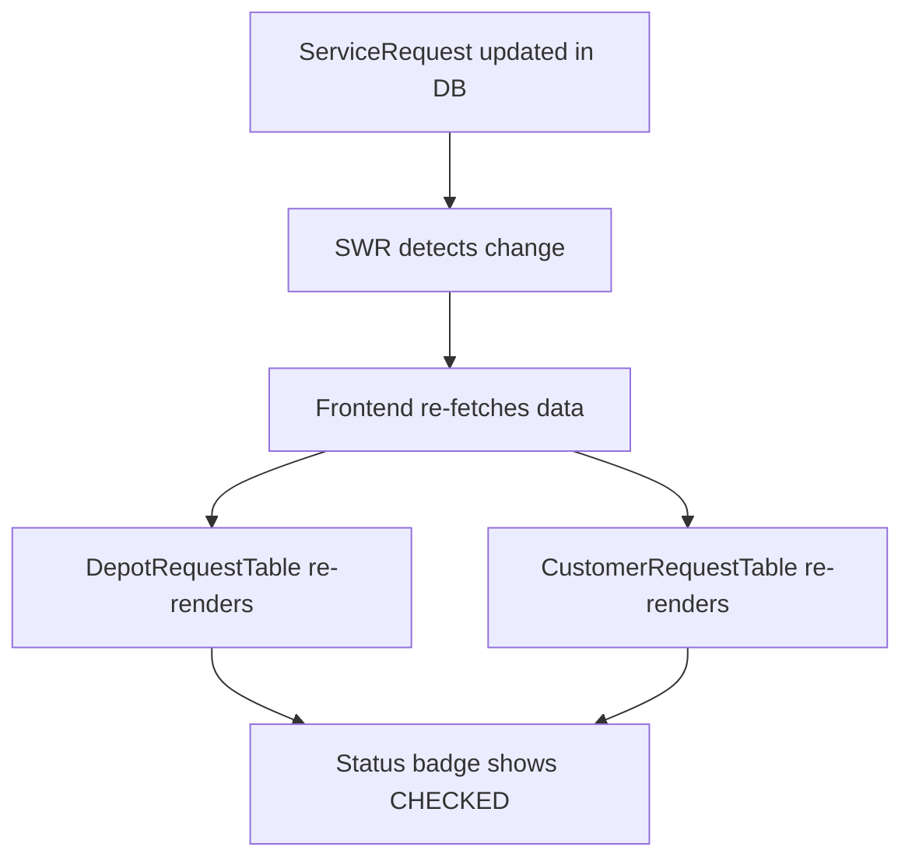

# Code Mapping và Debug Guide - v2025-01-27

## 🗂️ File Structure Overview

### **Backend Structure**
```
manageContainer/backend/
├── modules/
│   ├── maintenance/
│   │   ├── service/
│   │   │   └── MaintenanceService.ts          # 🔧 Logic đồng bộ RepairTicket ↔ ServiceRequest
│   │   ├── controller/
│   │   │   ├── MaintenanceController.ts       # 🎮 API endpoints cho maintenance
│   │   │   └── MaintenanceRoutes.ts          # 🛣️ Routes cho maintenance APIs
│   │   └── ...
│   ├── requests/
│   │   ├── service/
│   │   │   ├── RequestBaseService.ts         # 📋 Base service cho requests
│   │   │   ├── RequestStateMachine.ts        # 🔄 State machine cho request transitions
│   │   │   └── RequestCrudService.ts         # ✏️ CRUD operations cho requests
│   │   ├── controller/
│   │   │   └── RequestController.ts          # 🎮 API endpoints cho requests
│   │   └── ...
│   ├── yard/
│   │   ├── service/
│   │   │   └── YardService.ts                # 🏭 Logic quản lý yard và container placement + ForkliftTask creation
│   │   └── ...
│   ├── forklift/
│   │   ├── service/
│   │   │   └── ForkliftService.ts            # 🚛 Logic quản lý forklift tasks
│   │   ├── controller/
│   │   │   └── ForkliftController.ts         # 🎮 API endpoints cho forklift
│   │   └── ...
│   └── ...
├── docs/
│   ├── REPAIR_REQUEST_SYNC_FIX.md           # 📚 Documentation về fix đồng bộ
│   └── ...
└── ...
```

### **Frontend Structure**
```
manageContainer/frontend/
├── pages/
│   ├── Requests/
│   │   ├── Depot.tsx                        # 🏢 Trang depot requests
│   │   ├── Customer.tsx                     # 👤 Trang customer requests
│   │   └── components/
│   │       └── DepotRequestTable.tsx        # 📊 Table component cho depot
│   ├── Maintenance/
│   │   └── Repairs.tsx                      # 🔧 Trang maintenance repairs
│   ├── Forklift/
│   │   └── index.tsx                        # 🚛 Trang quản lý forklift tasks
│   ├── ContainersPage/
│   │   └── index.tsx                        # 📦 Trang quản lý container với derived_status logic
│   └── ...
├── components/
│   ├── RequestTable.tsx                     # 📋 Generic request table component
│   ├── Maintenance/
│   │   ├── RepairTable.tsx                  # 🔧 Repair table component
│   │   └── PendingContainersModal.tsx       # ⏳ Modal pending containers
│   └── ...
├── docs/
│   ├── STATUS_DISPLAY_CONSISTENCY.md        # 📚 Documentation về hiển thị trạng thái
│   └── ...
└── ...
```

## 🔍 Debug Flow Mapping

### **1. Forklift Task Creation Logic (SystemAdmin)**

```mermaid
graph TD
    A[SystemAdmin confirms container on Yard] --> B[YardService.confirm()]
    B --> C[Check if user is SystemAdmin]
    C --> D[Find latest ServiceRequest by container_no]
    D --> E{ServiceRequest status = 'CHECKED'?}
    E -->|Yes| F[Create ForkliftTask + Update to POSITIONED]
    E -->|No| G[Check RepairTicket status = 'CHECKED']
    G --> H{RepairTicket found?}
    H -->|Yes| F
    H -->|No| I[Only create ContainerMeta - No ForkliftTask]
    F --> J[ForkliftTask appears on Forklift page]
    I --> K[Container shows 'Đã xếp chỗ trong bãi' but no ForkliftTask]
```

### **2. Khi RepairTicket được cập nhật thành CHECKED**

```mermaid
graph TD
    A[User clicks Complete Repair] --> B[Frontend calls completeRepair API]
    B --> C[MaintenanceService.completeRepair()]
    C --> D[Update RepairTicket status to CHECKED]
    D --> E[Call updateRequestStatusByContainer()]
    E --> F[Find latest ServiceRequest by container_no]
    F --> G[Update ServiceRequest status to CHECKED]
    G --> H[Frontend SWR auto-refresh]
    H --> I[All pages show consistent CHECKED status]
```

### **2. Khi ServiceRequest được cập nhật**



## 🎯 Key Files và Functions

### **Backend - Yard Service (Forklift Task Logic)**
```typescript
// File: modules/yard/service/YardService.ts

// 🏭 Main yard confirmation with forklift task logic
async confirm(actor: any, slot_id: string, tier: number, container_no: string) {
  const isSystemAdmin = actor.role === 'SystemAdmin';
  
  if (isSystemAdmin) {
    // SystemAdmin: Logic mới - chỉ tạo ForkliftTask khi container có trạng thái "Đang chờ sắp xếp"
    const latestRequest = await tx.serviceRequest.findFirst({
      where: { container_no },
      orderBy: { createdAt: 'desc' }
    });
    
    const isWaitingForPlacement = latestRequest && latestRequest.status === 'CHECKED';
    
    // Nếu không có ServiceRequest CHECKED, kiểm tra RepairTicket
    let isWaitingFromRepair = false;
    if (!isWaitingForPlacement) {
      const repairTicket = await tx.repairTicket.findFirst({
        where: { container_no, status: 'CHECKED' },
        orderBy: { updatedAt: 'desc' }
      });
      isWaitingFromRepair = !!repairTicket;
    }
    
    const shouldCreateForkliftTask = isWaitingForPlacement || isWaitingFromRepair;
    
    if (shouldCreateForkliftTask) {
      // Tạo ForkliftTask + Cập nhật ServiceRequest nếu có
    } else {
      // Chỉ tạo ContainerMeta - không tạo ForkliftTask
    }
  } else {
    // Non-SystemAdmin: Giữ nguyên logic cũ - luôn tạo ForkliftTask
  }
}
```

### **Backend - Maintenance Service**
```typescript
// File: modules/maintenance/service/MaintenanceService.ts

// 🔧 Main sync function
private async updateRequestStatusByContainer(containerNo: string, repairStatus: string) {
  // Tìm ServiceRequest mới nhất
  // Mapping repair status → request status
  // Cập nhật ServiceRequest nếu cần
}

// 🔧 Complete repair with sync
async completeRepair(actor: any, repairTicketId: string) {
  // Cập nhật RepairTicket thành CHECKED
  // Gọi updateRequestStatusByContainer để đồng bộ
}

// 🔧 Manual sync API
async syncRepairTicketStatus(containerNo: string) {
  // Đồng bộ thủ công RepairTicket → ServiceRequest
}
```

### **Backend - Request State Machine**
```typescript
// File: modules/requests/service/RequestStateMachine.ts

// 🔄 Valid transitions
const TRANSITIONS = [
  {
    from: 'CHECKING',
    to: 'CHECKED',
    allowedRoles: ['TechnicalDepartment', 'SystemAdmin'],
    description: 'Hoàn thành kiểm tra - đạt chuẩn'
  }
  // ... other transitions
];
```

### **Frontend - Container Status Logic**
```typescript
// File: pages/ContainersPage/index.tsx

// 📦 Derived status logic for container display
const processedItems = React.useMemo(() => {
  data.items.forEach((it: any) => {
    const inYard = !!it.slot_code;
    
    if (inYard) {
      // Container có slot_code - đã xếp chỗ trong bãi
      if (it.service_status === 'CHECKED' || it.repair_checked === true) {
        // Container đã được kiểm tra (CHECKED) - trạng thái bình thường
        containerMap.set(it.container_no, { ...it, derived_status: 'ASSIGNED' });
      } else if (it.service_status === 'SYSTEM_ADMIN_ADDED') {
        // Container được SystemAdmin nhập trực tiếp vào bãi
        containerMap.set(it.container_no, { ...it, derived_status: 'EMPTY_IN_YARD' });
      }
    } else {
      // Container chưa có slot_code
      if (it.service_status === 'CHECKED' || it.repair_checked === true) {
        // Container đã kiểm tra nhưng chưa xếp chỗ - đang chờ sắp xếp
        containerMap.set(it.container_no, { ...it, derived_status: 'WAITING' });
      }
    }
  });
}, [data?.items]);
```

### **Frontend - Status Display**
```typescript
// File: pages/Requests/Depot.tsx

// 🎨 Status label mapping
const getStatusLabel = (status: string) => {
  const statusConfig: Record<string, string> = {
    CHECKING: safeT('pages.requests.filterOptions.checking', 'Checking'),
    CHECKED: safeT('pages.requests.filterOptions.checked', 'Checked'),
    // ... other statuses
  };
  return statusConfig[status] || status;
};
```

## 🐛 Common Debug Scenarios

### **Scenario 1: Container shows "Đã xếp chỗ trong bãi" but no ForkliftTask appears**

**Debug Steps:**
1. Check container status in database:
   ```sql
   -- Check ServiceRequest status
   SELECT container_no, status, updatedAt 
   FROM "ServiceRequest" 
   WHERE container_no = 'ISO 1112' 
   ORDER BY createdAt DESC;
   
   -- Check RepairTicket status
   SELECT container_no, status, updatedAt 
   FROM "RepairTicket" 
   WHERE container_no = 'ISO 1112' 
   ORDER BY updatedAt DESC;
   ```

2. Check YardPlacement status:
   ```sql
   SELECT container_no, status, slot_id, placed_at
   FROM "YardPlacement" 
   WHERE container_no = 'ISO 1112' 
   ORDER BY placed_at DESC;
   ```

3. Check backend logs for forklift task creation:
   ```bash
   # Look for these log messages:
   # "🔍 [SystemAdmin] Processing container ISO 1112 for forklift task creation"
   # "🔍 [SystemAdmin] Is waiting for placement (ServiceRequest): true/false"
   # "🔍 [SystemAdmin] Is waiting for placement (RepairTicket): true/false"
   # "✅ [SystemAdmin] Creating forklift task for ISO 1112" OR "❌ [SystemAdmin] NOT creating forklift task"
   ```

4. Check if user is SystemAdmin:
   ```sql
   SELECT role FROM "User" WHERE email = 'admin@smartlog.local';
   ```

### **Scenario 2: Container shows CHECKING in Requests but CHECKED in Maintenance**

**Debug Steps:**
1. Check RepairTicket status in database:
   ```sql
   SELECT container_no, status, updatedAt 
   FROM "RepairTicket" 
   WHERE container_no = 'ISO 1113' 
   ORDER BY updatedAt DESC;
   ```

2. Check ServiceRequest status in database:
   ```sql
   SELECT container_no, status, updatedAt 
   FROM "ServiceRequest" 
   WHERE container_no = 'ISO 1113' 
   ORDER BY createdAt DESC;
   ```

3. Check backend logs for sync activity:
   ```bash
   # Look for these log messages:
   # "🔄 RepairTicket ISO 1113 đã được cập nhật thành CHECKED - bắt đầu đồng bộ ServiceRequest"
   # "✅ Đã đồng bộ ServiceRequest cmfc6bnic001jrne3miq3ij5i thành CHECKED"
   ```

4. Manual sync if needed:
   ```bash
   curl -X POST http://localhost:5001/maintenance/repairs/sync-status \
     -H "Authorization: Bearer <token>" \
     -H "Content-Type: application/json" \
     -d '{"container_no": "ISO 1113"}'
   ```

### **Scenario 2: Frontend not showing updated status**

**Debug Steps:**
1. Check SWR cache:
   ```javascript
   // In browser console
   console.log(swrCache);
   ```

2. Force refresh SWR cache:
   ```javascript
   // In browser console
   mutate('/requests?page=1&limit=20');
   ```

3. Check network requests:
   - Open DevTools → Network tab
   - Look for GET /requests calls
   - Verify response data contains correct status

### **Scenario 3: Sync logic not working**

**Debug Steps:**
1. Check MaintenanceService logs:
   ```bash
   # Look for sync-related logs
   grep "RepairTicket.*đã được cập nhật" logs/access.log
   ```

2. Test sync function directly:
   ```typescript
   // In MaintenanceService
   await this.updateRequestStatusByContainer('ISO 1113', 'CHECKED');
   ```

3. Check database constraints:
   ```sql
   -- Verify foreign key relationships
   SELECT * FROM information_schema.table_constraints 
   WHERE table_name IN ('RepairTicket', 'ServiceRequest');
   ```

## 🔧 API Endpoints Reference

### **Forklift APIs**
```bash
# Get forklift tasks
GET /forklift/jobs?status=PENDING

# Assign forklift task to driver
POST /forklift/assign
Body: {"container_no": "ISO 1112", "driver_id": "driver123"}

# Update task status
PATCH /forklift/task/:id/status
Body: {"status": "IN_PROGRESS", "notes": "Started moving container"}

# Approve completed task
POST /forklift/job/:id/approve
```

### **Yard APIs**
```bash
# Confirm container placement (triggers forklift task creation)
POST /yard/stack/confirm
Body: {"slot_id": "slot123", "tier": 1, "container_no": "ISO 1112"}

# Get yard map
GET /yard/map
```

### **Maintenance APIs**
```bash
# Get repairs by status
GET /maintenance/repairs?status=CHECKED

# Complete repair (triggers sync)
POST /maintenance/repairs/:id/complete

# Manual sync
POST /maintenance/repairs/sync-status
Body: {"container_no": "ISO 1113"}
```

### **Request APIs**
```bash
# Get requests
GET /requests?page=1&limit=20

# Update request status
PATCH /requests/:id/status
Body: {"status": "CHECKED"}
```

## 📊 Database Schema Reference

### **RepairTicket Table**
```sql
CREATE TABLE "RepairTicket" (
  id TEXT PRIMARY KEY,
  container_no TEXT,
  status "RepairStatus" DEFAULT 'CHECKING',
  updatedAt TIMESTAMP DEFAULT CURRENT_TIMESTAMP,
  -- ... other fields
);

-- RepairStatus enum
CREATE TYPE "RepairStatus" AS ENUM (
  'CHECKING',
  'PENDING_ACCEPT', 
  'ACCEPT',
  'REPAIRING',
  'CHECKED',
  'REJECTED'
);
```

### **ServiceRequest Table**
```sql
CREATE TABLE "ServiceRequest" (
  id TEXT PRIMARY KEY,
  container_no TEXT,
  status TEXT DEFAULT 'PENDING',
  updatedAt TIMESTAMP DEFAULT CURRENT_TIMESTAMP,
  -- ... other fields
);
```

### **ForkliftTask Table**
```sql
CREATE TABLE "ForkliftTask" (
  id TEXT PRIMARY KEY,
  container_no TEXT NOT NULL,
  from_slot_id TEXT,
  to_slot_id TEXT,
  status TEXT NOT NULL, -- PENDING | IN_PROGRESS | COMPLETED | CANCELLED
  assigned_driver_id TEXT,
  created_by TEXT NOT NULL,
  cancel_reason TEXT,
  createdAt TIMESTAMP DEFAULT CURRENT_TIMESTAMP,
  updatedAt TIMESTAMP DEFAULT CURRENT_TIMESTAMP,
  
  FOREIGN KEY (from_slot_id) REFERENCES "YardSlot"(id),
  FOREIGN KEY (to_slot_id) REFERENCES "YardSlot"(id),
  FOREIGN KEY (assigned_driver_id) REFERENCES "User"(id),
  FOREIGN KEY (created_by) REFERENCES "User"(id)
);
```

### **YardPlacement Table**
```sql
CREATE TABLE "YardPlacement" (
  id TEXT PRIMARY KEY,
  slot_id TEXT NOT NULL,
  tier INTEGER NOT NULL,
  container_no TEXT,
  status TEXT NOT NULL, -- HOLD | OCCUPIED | REMOVED
  hold_expires_at TIMESTAMP,
  placed_at TIMESTAMP DEFAULT CURRENT_TIMESTAMP,
  removed_at TIMESTAMP,
  created_by TEXT NOT NULL,
  updatedAt TIMESTAMP DEFAULT CURRENT_TIMESTAMP,
  
  UNIQUE(slot_id, tier),
  FOREIGN KEY (slot_id) REFERENCES "YardSlot"(id),
  FOREIGN KEY (created_by) REFERENCES "User"(id)
);
```

## 🚀 Performance Monitoring

### **Key Metrics to Monitor**
1. **Sync Success Rate:** % of successful syncs
2. **Sync Latency:** Time from RepairTicket update to ServiceRequest update
3. **Frontend Refresh Rate:** How often SWR refreshes data
4. **Error Rate:** Failed sync attempts
5. **Forklift Task Creation Rate:** % of containers that get forklift tasks when expected
6. **Forklift Task Completion Time:** Average time from PENDING to COMPLETED
7. **Container Placement Accuracy:** % of containers placed correctly in yard

### **Log Patterns to Watch**
```bash
# Success patterns
grep "✅ Đã đồng bộ ServiceRequest" logs/access.log
grep "✅ \[SystemAdmin\] Creating forklift task" logs/access.log

# Error patterns  
grep "❌ Lỗi khi đồng bộ ServiceRequest" logs/access.log
grep "❌ \[SystemAdmin\] NOT creating forklift task" logs/access.log

# Performance patterns
grep "🔄 RepairTicket.*bắt đầu đồng bộ" logs/access.log
grep "🔍 \[SystemAdmin\] Processing container" logs/access.log
```

## 🔄 Maintenance Tasks

### **Daily Checks**
1. Verify sync logs for any errors
2. Check for containers with inconsistent status
3. Monitor API response times
4. Check forklift task creation logs for SystemAdmin actions
5. Verify containers with "Đã xếp chỗ trong bãi" have appropriate forklift tasks

### **Weekly Tasks**
1. Review sync performance metrics
2. Check for any stuck containers
3. Verify database integrity
4. Review forklift task completion rates
5. Check for containers placed without proper forklift tasks

### **Monthly Tasks**
1. Analyze sync patterns and optimize if needed
2. Review and update documentation
3. Test sync functionality with edge cases
4. Analyze forklift task workflow efficiency
5. Review container placement accuracy metrics

---

**Tác giả:** AI Assistant  
**Ngày cập nhật:** 2025-01-27  
**Phiên bản:** 2.0  
**Trạng thái:** ✅ Hoàn thành - Đã cập nhật Forklift Task Logic
