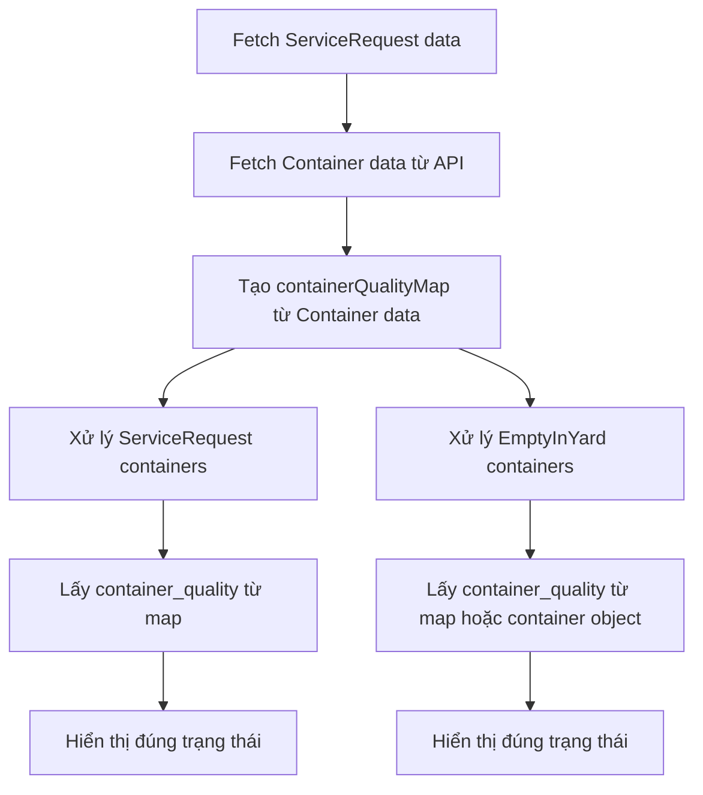

# 🔧 Sửa Logic Container Quality - v2025-01-27

## 📋 **Vấn đề**

Sau khi sửa API để trả về `container_quality`, vấn đề vẫn chưa được giải quyết. Khi F5 trang ManagerCont, trạng thái container vẫn hiển thị sai.

## 🔍 **Nguyên nhân gốc rễ**

### **1. ServiceRequest không có trường `container_quality`**
- Chỉ có **Container model** mới có trường `container_quality`
- **ServiceRequest model** không có trường này
- Logic frontend đang cố gắng lấy `container_quality` từ ServiceRequest data

### **2. Logic xử lý sai nguồn dữ liệu**
- Frontend fetch cả ServiceRequest data và Container data
- Nhưng logic xử lý `container_quality` đang cố gắng lấy từ ServiceRequest
- Cần lấy từ Container data thay vì ServiceRequest data

## ✅ **Giải pháp đã triển khai**

### **1. Tạo Map để lưu container_quality từ Container data**

```typescript
// Tạo map để lưu container_quality từ Container data
const containerQualityMap = new Map<string, 'GOOD' | 'NEED_REPAIR' | 'UNKNOWN'>();

// Lưu container_quality từ Container data vào map
emptyInYardContainers.forEach(container => {
  if (container.container_quality) {
    containerQualityMap.set(container.container_no, container.container_quality);
  }
});
```

### **2. Cập nhật logic xử lý ServiceRequest**

```typescript
// 🔄 ƯU TIÊN: Sử dụng container_quality từ Container data nếu có
const containerQualityFromMap = containerQualityMap.get(request.container_no);

if (containerQualityFromMap) {
  containerQuality = containerQualityFromMap;
  console.log(`📊 Sử dụng container_quality từ Container data cho ${request.container_no}: ${containerQuality}`);
} else {
  // Fallback: Tính toán từ RepairTicket status
  if (repairTicketStatus === 'COMPLETE') {
    containerQuality = 'GOOD';
  } else if (repairTicketStatus === 'COMPLETE_NEEDREPAIR') {
    containerQuality = 'NEED_REPAIR';
  } else {
    containerQuality = 'UNKNOWN';
  }
}
```

### **3. Cập nhật logic xử lý EmptyInYard containers**

```typescript
// 🔄 ƯU TIÊN: Sử dụng container_quality từ Container data nếu có
const containerQualityFromMap = containerQualityMap.get(container.container_no);

if (containerQualityFromMap) {
  containerQuality = containerQualityFromMap;
  console.log(`📊 EmptyInYard: Sử dụng container_quality từ Container data cho ${container.container_no}: ${containerQuality}`);
} else if (container.container_quality) {
  containerQuality = container.container_quality as 'GOOD' | 'NEED_REPAIR' | 'UNKNOWN';
  console.log(`📊 EmptyInYard: Sử dụng container_quality từ container object cho ${container.container_no}: ${containerQuality}`);
} else {
  // Fallback: Tính toán từ RepairTicket status
}
```

## 🔄 **Luồng dữ liệu mới**



## 🎯 **Kết quả**

### **✅ Trước khi sửa:**
1. User cập nhật: "Container tốt" → "Cần sửa chữa"
2. Backend lưu `container_quality = 'NEED_REPAIR'` vào Container table
3. User F5 → Frontend fetch data
4. Logic cố gắng lấy `container_quality` từ ServiceRequest (không có)
5. Fallback về RepairTicket status → hiển thị sai trạng thái

### **✅ Sau khi sửa:**
1. User cập nhật: "Container tốt" → "Cần sửa chữa"
2. Backend lưu `container_quality = 'NEED_REPAIR'` vào Container table
3. User F5 → Frontend fetch data
4. Tạo `containerQualityMap` từ Container data
5. Logic lấy `container_quality` từ map → hiển thị đúng trạng thái

## 📁 **Files đã sửa**

1. **`DepotManager/frontend/pages/ManagerCont.tsx`**
   - Tạo `containerQualityMap` để lưu container_quality từ Container data
   - Cập nhật logic xử lý ServiceRequest để sử dụng map
   - Cập nhật logic xử lý EmptyInYard containers để sử dụng map
   - Thêm debug logs để theo dõi luồng dữ liệu

## 🧪 **Test Cases**

### **Test 1: Container có container_quality trong database**
1. Cập nhật container quality trong ManagerCont
2. F5 trang
3. **Kết quả mong đợi**: Hiển thị đúng trạng thái đã cập nhật

### **Test 2: Container không có container_quality**
1. Container chưa được cập nhật quality
2. F5 trang
3. **Kết quả mong đợi**: Tính toán từ RepairTicket status (fallback)

### **Test 3: Debug logs**
1. Mở Developer Console
2. F5 trang ManagerCont
3. **Kết quả mong đợi**: Thấy debug logs hiển thị:
   - API response có `container_quality`
   - Logic sử dụng `container_quality` từ map
   - Trạng thái hiển thị đúng

## 📝 **Ghi chú**

- **Data source priority**: Container data > RepairTicket status
- **Backward compatibility**: Logic fallback đảm bảo container cũ vẫn hoạt động
- **Performance**: Map lookup O(1) nên không ảnh hưởng hiệu suất
- **Debug**: Console logs giúp theo dõi luồng dữ liệu


