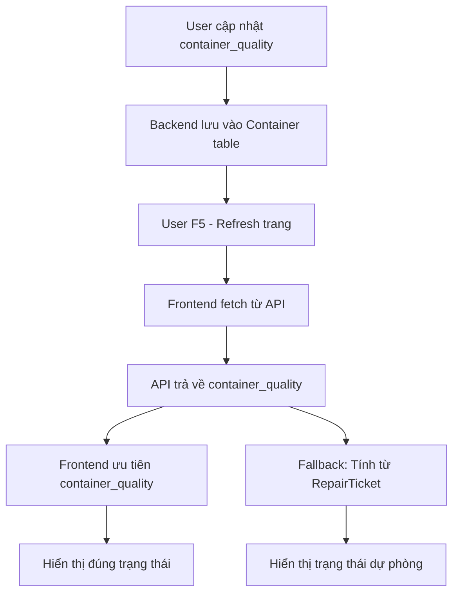

# 🔧 Sửa Lỗi Container Quality Không Hiển Thị Sau F5

## 📋 **Vấn đề**

Khi cập nhật trạng thái container từ "Container tốt" sang "Cần sửa chữa" hoặc ngược lại trong ManagerCont, dữ liệu được lưu ở backend nhưng khi F5 (refresh) trang thì frontend không hiển thị đúng trạng thái mới.

## 🔍 **Nguyên nhân**

### **1. Backend không trả về `container_quality`**
- API `reportsService.getContainers()` không include trường `container_quality` từ bảng Container
- Query SQL trong `ReportsRepository.containerList()` thiếu `c.container_quality`

### **2. Frontend không sử dụng `container_quality` từ API**
- Logic frontend chỉ tính toán `containerQuality` từ RepairTicket status
- Không ưu tiên sử dụng `container_quality` từ database

### **3. Interface thiếu trường `container_quality`**
- `ContainerItem` interface không có trường `container_quality`
- TypeScript báo lỗi khi truy cập thuộc tính này

## ✅ **Giải pháp đã triển khai**

### **1. Backend: Thêm `container_quality` vào API response**

#### **ReportsRepository.containerList():**
```sql
-- Thêm c.container_quality vào SELECT
SELECT DISTINCT ON (bc.container_no)
  bc.container_no,
  -- ... other fields ...
  c.container_quality,  -- ✅ THÊM TRƯỜNG NÀY
  ls.request_no
FROM base_containers bc
LEFT JOIN "Container" c ON c.container_no = bc.container_no
```

### **2. Frontend: Cập nhật interface và logic**

#### **ContainerItem interface:**
```typescript
export interface ContainerItem {
  container_no: string;
  // ... other fields ...
  container_quality?: 'GOOD' | 'NEED_REPAIR' | 'UNKNOWN'; // ✅ THÊM TRƯỜNG NÀY
}
```

#### **Logic ưu tiên container_quality:**
```typescript
// 🔄 ƯU TIÊN: Sử dụng container_quality từ database nếu có
if (container.container_quality) {
  containerQuality = container.container_quality as 'GOOD' | 'NEED_REPAIR' | 'UNKNOWN';
  console.log(`📊 Sử dụng container_quality từ database cho ${container.container_no}: ${containerQuality}`);
} else {
  // Fallback: Tính toán từ RepairTicket status
  if (repairTicketStatus === 'COMPLETE') {
    containerQuality = 'GOOD';
  } else if (repairTicketStatus === 'COMPLETE_NEEDREPAIR') {
    containerQuality = 'NEED_REPAIR';
  } else {
    containerQuality = 'UNKNOWN';
  }
}
```

## 🎯 **Kết quả**

### **✅ Trước khi sửa:**
1. User cập nhật: "Container tốt" → "Cần sửa chữa"
2. Backend lưu `container_quality = 'NEED_REPAIR'` vào database
3. User F5 → Frontend fetch data từ API
4. API không trả về `container_quality`
5. Frontend tính toán từ RepairTicket → hiển thị sai trạng thái

### **✅ Sau khi sửa:**
1. User cập nhật: "Container tốt" → "Cần sửa chữa"
2. Backend lưu `container_quality = 'NEED_REPAIR'` vào database
3. User F5 → Frontend fetch data từ API
4. API trả về `container_quality = 'NEED_REPAIR'`
5. Frontend ưu tiên sử dụng `container_quality` → hiển thị đúng trạng thái

## 📁 **Files đã sửa**

1. **`DepotManager/backend/modules/reports/repository/ReportsRepository.ts`**
   - Thêm `c.container_quality` vào SELECT query

2. **`DepotManager/frontend/services/reports.ts`**
   - Thêm `container_quality?: 'GOOD' | 'NEED_REPAIR' | 'UNKNOWN'` vào ContainerItem interface

3. **`DepotManager/frontend/pages/ManagerCont.tsx`**
   - Cập nhật logic ưu tiên sử dụng `container_quality` từ database
   - Fallback về RepairTicket status nếu không có `container_quality`

## 🔄 **Luồng hoạt động mới**



## 🧪 **Test Cases**

### **Test 1: Cập nhật từ "Container tốt" → "Cần sửa chữa"**
1. Mở ManagerCont
2. Tìm container có trạng thái "Container tốt"
3. Cập nhật thành "Cần sửa chữa"
4. F5 trang
5. **Kết quả mong đợi**: Hiển thị "Cần sửa chữa"

### **Test 2: Cập nhật từ "Cần sửa chữa" → "Container tốt"**
1. Mở ManagerCont
2. Tìm container có trạng thái "Cần sửa chữa"
3. Cập nhật thành "Container tốt"
4. F5 trang
5. **Kết quả mong đợi**: Hiển thị "Container tốt"

### **Test 3: Container không có container_quality**
1. Tìm container chưa có `container_quality` trong database
2. F5 trang
3. **Kết quả mong đợi**: Tính toán từ RepairTicket status (fallback)

## 📝 **Ghi chú**

- **Backward compatibility**: Logic fallback đảm bảo container cũ vẫn hoạt động
- **Performance**: Không ảnh hưởng đến hiệu suất vì chỉ thêm 1 trường vào SELECT
- **Data consistency**: Ưu tiên `container_quality` từ database thay vì tính toán từ RepairTicket
