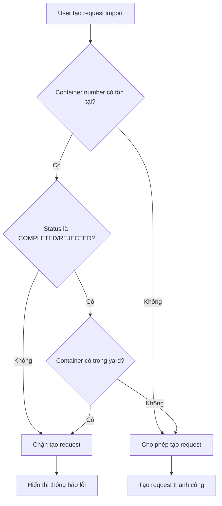

# 🔒 Container Duplicate Validation

## Tổng quan

Tài liệu này mô tả logic validation ngăn chặn tạo request import trùng lặp với cùng một container number. Hệ thống chỉ cho phép tạo request import mới khi container không còn tồn tại trong hệ thống.

## 🎯 Mục đích

- **Ngăn chặn duplicate**: Không cho phép tạo nhiều request import với cùng container number
- **Đảm bảo tính nhất quán**: Mỗi container chỉ có thể có một request import đang hoạt động
- **Cải thiện UX**: Hiển thị thông báo lỗi rõ ràng cho người dùng

## 🔧 Logic Validation

### Backend Validation

**File:** `modules/requests/service/RequestBaseService.ts`

```typescript
/**
 * Kiểm tra container number chưa tồn tại trong hệ thống
 * Chỉ cho phép tạo request import mới khi container chưa có trong hệ thống
 */
private async validateContainerNotExists(container_no: string) {
    // 1. Kiểm tra ServiceRequest với status chưa hoàn thành
    const existingRequest = await prisma.serviceRequest.findFirst({
        where: {
            container_no: container_no,
            type: 'IMPORT',
            status: {
                notIn: ['COMPLETED', 'REJECTED', 'GATE_REJECTED']
            }
        },
        orderBy: { createdAt: 'desc' }
    });

    if (existingRequest) {
        throw new Error(`Container ${container_no} đã tồn tại trong hệ thống với trạng thái ${existingRequest.status}. Chỉ có thể tạo request mới khi container không còn trong hệ thống.`);
    }

    // 2. Kiểm tra YardPlacement (container đã được đặt vào yard)
    const existingPlacement = await prisma.yardPlacement.findFirst({
        where: {
            container_no: container_no,
            status: 'OCCUPIED',
            removed_at: null
        }
    });

    if (existingPlacement) {
        throw new Error(`Container ${container_no} đã được đặt vào yard và chưa được xuất. Không thể tạo request import mới.`);
    }
}
```

### Frontend Error Handling

**File:** `components/RequestForm.tsx`

```typescript
// Xử lý lỗi từ API
catch (error: any) {
    setMessage(error?.response?.data?.message || t('common.error'));
} finally {
    setLoading(false);
}

// Hiển thị thông báo lỗi
{message && (
    <div className={`form-message ${message.includes(t('pages.requests.form.success')) ? 'success' : 'error'}`}>
        {message}
    </div>
)}
```

## 📋 Các Trường Hợp Validation

### 1. Container Đã Có Request Import Đang Hoạt Động

**Trạng thái bị chặn:**
- `PENDING` - Chờ xử lý
- `SCHEDULED` - Đã đặt lịch
- `FORWARDED` - Đã chuyển tiếp
- `GATE_IN` - Đã vào cổng
- `PENDING` - Đang chờ
- `IN_PROGRESS` - Đang xử lý/sửa chữa
- `COMPLETED` - Hoàn tất
- `CANCELLED` - Hủy
- `POSITIONED` - Đã định vị
- `FORKLIFTING` - Đang vận chuyển
- `IN_YARD` - Trong bãi
- `IN_CAR` - Trên xe
- `GATE_OUT` - Ra cổng

**Trạng thái cho phép tạo mới:**
- `COMPLETED` - Hoàn thành
- `REJECTED` - Bị từ chối
- `GATE_REJECTED` - Cổng từ chối

### 2. Container Đã Được Đặt Vào Yard

**Điều kiện chặn:**
- `YardPlacement.status = 'OCCUPIED'`
- `YardPlacement.removed_at = null`

## 🔄 Luồng Xử Lý



## 🧪 Testing

### Test Script

**File:** `test-container-validation.js`

```javascript
// Test validation logic
const testContainer = 'ISO 1234'; // Container đã tồn tại

// Kiểm tra request với status chưa hoàn thành
const activeRequest = await prisma.serviceRequest.findFirst({
    where: {
        container_no: testContainer,
        type: 'IMPORT',
        status: { notIn: ['COMPLETED', 'REJECTED', 'GATE_REJECTED'] }
    }
});

if (activeRequest) {
    console.log(`❌ Container ${testContainer} đã tồn tại với status: ${activeRequest.status}`);
    console.log(`✅ Validation sẽ chặn tạo request mới`);
}
```

### Test Cases

1. **Container mới** → ✅ Cho phép tạo
2. **Container đã COMPLETED** → ✅ Cho phép tạo
3. **Container đang PENDING** → ❌ Chặn tạo
4. **Container trong yard** → ❌ Chặn tạo

## 📁 File Mapping

### Backend Files

| File | Mô tả | Vai trò |
|------|-------|---------|
| `modules/requests/service/RequestBaseService.ts` | Service chính xử lý request | Chứa logic validation `validateContainerNotExists()` |
| `modules/requests/controller/RequestController.ts` | Barrel controller | Re-export các handler |
| `modules/requests/dto/RequestDtos.ts` | Schema validation | Validation cơ bản cho form data |
| `prisma/schema.prisma` | Database schema | Định nghĩa cấu trúc ServiceRequest và YardPlacement |

### Frontend Files

| File | Mô tả | Vai trò |
|------|-------|---------|
| `components/RequestForm.tsx` | Form tạo request | Hiển thị lỗi từ API |
| (ĐÃ GỠ) `pages/Requests/Customer.tsx` | Trang Customer | Đã xoá khỏi codebase |
| `services/api.ts` | API service | Gửi request đến backend |

## 🚀 Deployment

### Backend Changes

1. **RequestBaseService.ts** - Thêm method `validateContainerNotExists()`
2. **RequestController.ts** - Không cần thay đổi (đã xử lý lỗi)
3. **Database** - Không cần migration

### Frontend Changes

1. **RequestForm.tsx** - Đã có sẵn error handling
2. **Translation** - Có thể thêm message tùy chỉnh

## 🔍 Monitoring

### Logs

```typescript
// Log khi validation fail
console.log(`Container validation failed: ${container_no} - ${error.message}`);
```

### Metrics

- Số lượng request bị chặn do duplicate
- Container numbers bị duplicate nhiều nhất
- Thời gian response validation

## 📝 Notes

- Validation chỉ áp dụng cho request type `IMPORT`
- Request type `EXPORT` không cần validation container number
- Logic có thể mở rộng để kiểm tra thêm các điều kiện khác
- Có thể thêm cache để tối ưu performance

## 🔄 Future Enhancements

1. **Soft Delete Support**: Kiểm tra soft-deleted requests
2. **Tenant Isolation**: Validation theo tenant
3. **Audit Trail**: Log chi tiết các lần validation
4. **Bulk Validation**: Validate nhiều containers cùng lúc
5. **Real-time Check**: Kiểm tra real-time khi user nhập container number
