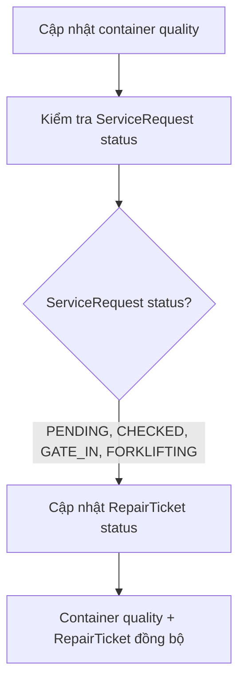
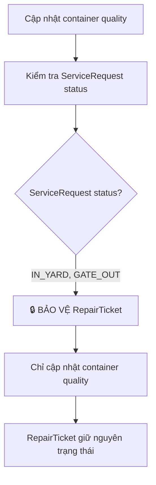

# Container Quality Update Protection - v2025-01-27

## 📋 Tổng quan

Tài liệu này mô tả việc bảo vệ trạng thái RepairTicket khi cập nhật container quality từ trang ManagerCont, đảm bảo không làm reset quá trình sửa chữa đã hoàn thành.

## 🎯 Vấn đề được giải quyết

### **Mô tả vấn đề:**
- Khi cập nhật container quality từ "Cần sửa chữa" → "Container tốt" ở trang ManagerCont
- Hệ thống tự động cập nhật RepairTicket status từ `COMPLETE_NEEDREPAIR` → `COMPLETE`
- Điều này làm reset trạng thái phiếu trong Maintenance/Repairs từ "Chấp nhận - cần sửa" về "Chấp nhận"
- **Không mong muốn**: Reset quá trình sửa chữa đã hoàn thành

### **Yêu cầu:**
- Nếu ServiceRequest đã ở trạng thái `IN_YARD` hoặc `GATE_OUT` (quá trình đã hoàn thành)
- **KHÔNG** cập nhật RepairTicket status
- Chỉ cập nhật container quality để hiển thị đúng ở ManagerCont
- Giữ nguyên trạng thái phiếu trong Maintenance/Repairs

## 🔧 Giải pháp đã thực hiện

### **Logic bảo vệ trong ContainerController.updateContainerInfo():**

```typescript
// Cập nhật container_quality bằng cách cập nhật RepairTicket
if (container_quality) {
  // Tìm RepairTicket mới nhất của container này
  const latestRepairTicket = await prisma.repairTicket.findFirst({
    where: { container_no },
    orderBy: { createdAt: 'desc' }
  });

  if (latestRepairTicket) {
    // 🔒 BẢO VỆ: Kiểm tra ServiceRequest status trước khi cập nhật RepairTicket
    const serviceRequest = await prisma.serviceRequest.findFirst({
      where: { 
        container_no,
        type: 'IMPORT'
      },
      orderBy: { createdAt: 'desc' }
    });

    // Nếu ServiceRequest đã ở trạng thái IN_YARD hoặc GATE_OUT, KHÔNG cập nhật RepairTicket
    if (serviceRequest && (serviceRequest.status === 'IN_YARD' || serviceRequest.status === 'GATE_OUT')) {
      console.log(`🔒 Bảo vệ RepairTicket cho container ${container_no}: ServiceRequest đã ở trạng thái ${serviceRequest.status}, không cập nhật RepairTicket`);
      console.log(`ℹ️ Container quality được cập nhật thành ${container_quality} nhưng RepairTicket giữ nguyên trạng thái ${latestRepairTicket.status}`);
    } else {
      // Chỉ cập nhật RepairTicket khi ServiceRequest chưa ở trạng thái cuối
      let repairStatus: 'COMPLETE' | 'COMPLETE_NEEDREPAIR' | 'PENDING' = 'PENDING';
      if (container_quality === 'GOOD') {
        repairStatus = 'COMPLETE';
      } else if (container_quality === 'NEED_REPAIR') {
        repairStatus = 'COMPLETE_NEEDREPAIR';
      }
      
      console.log(`🔄 Cập nhật RepairTicket cho container ${container_no}: ${latestRepairTicket.status} → ${repairStatus}`);
      
      await prisma.repairTicket.update({
        where: { id: latestRepairTicket.id },
        data: { 
          status: repairStatus,
          updatedAt: new Date()
        }
      });
    }
  }
}
```

## 📊 Luồng xử lý mới

### **Trường hợp 1: ServiceRequest chưa hoàn thành (PENDING, CHECKED, GATE_IN, FORKLIFTING)**


### **Trường hợp 2: ServiceRequest đã hoàn thành (IN_YARD, GATE_OUT)**


## 🎯 Kết quả mong đợi

### **Container IM9996 - Trường hợp test:**

**Trước khi cập nhật:**
- **ManagerCont**: Trạng thái "CẦN SỬA CHỮA"
- **Maintenance/Repairs**: Trạng thái phiếu "Chấp nhận - cần sửa"
- **ServiceRequest**: Status `IN_YARD` hoặc `GATE_OUT`

**Sau khi cập nhật container quality → "Container tốt":**
- **ManagerCont**: Trạng thái "CONTAINER TỐT" ✅
- **Maintenance/Repairs**: Trạng thái phiếu vẫn "Chấp nhận - cần sửa" ✅
- **RepairTicket**: Status vẫn `COMPLETE_NEEDREPAIR` ✅

## 🔍 Logging và Debug

### **Console logs khi bảo vệ RepairTicket:**
```
🔒 Bảo vệ RepairTicket cho container IM9996: ServiceRequest đã ở trạng thái IN_YARD, không cập nhật RepairTicket
ℹ️ Container quality được cập nhật thành GOOD nhưng RepairTicket giữ nguyên trạng thái COMPLETE_NEEDREPAIR
```

### **Console logs khi cập nhật RepairTicket:**
```
🔄 Cập nhật RepairTicket cho container IM1234: COMPLETE_NEEDREPAIR → COMPLETE
```

## 🗂️ Files đã thay đổi

### **Backend:**
- `modules/containers/controller/ContainerController.ts` - Thêm logic bảo vệ RepairTicket

### **Documentation:**
- `docs/CONTAINER_QUALITY_UPDATE_PROTECTION.md` - Tài liệu này

## 🚀 Cách test

1. **Chuẩn bị dữ liệu:**
   - Container có RepairTicket với status `COMPLETE_NEEDREPAIR`
   - ServiceRequest với status `IN_YARD` hoặc `GATE_OUT`

2. **Thực hiện test:**
   - Vào trang ManagerCont
   - Mở modal "Cập nhật thông tin container"
   - Thay đổi trạng thái từ "Cần sửa chữa" → "Container tốt"
   - Lưu thay đổi

3. **Kiểm tra kết quả:**
   - ManagerCont: Hiển thị "CONTAINER TỐT"
   - Maintenance/Repairs: Vẫn hiển thị "Chấp nhận - cần sửa"
   - Console logs: Hiển thị thông báo bảo vệ RepairTicket

## ✅ Lợi ích

1. **Bảo vệ dữ liệu**: Không làm mất thông tin quá trình sửa chữa
2. **Tính nhất quán**: Hiển thị đúng trạng thái ở cả hai trang
3. **Linh hoạt**: Vẫn cho phép cập nhật khi ServiceRequest chưa hoàn thành
4. **Audit trail**: Có logging chi tiết để debug và monitor

