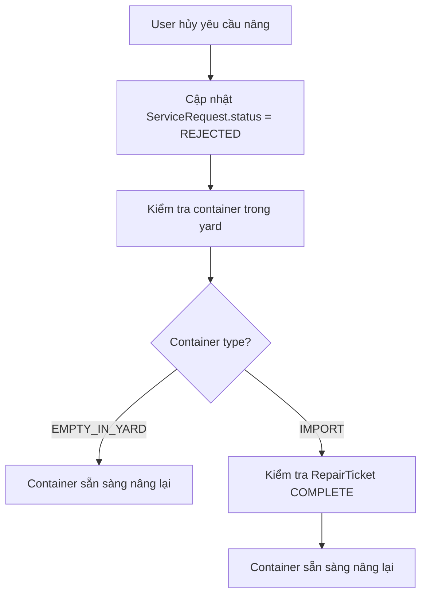
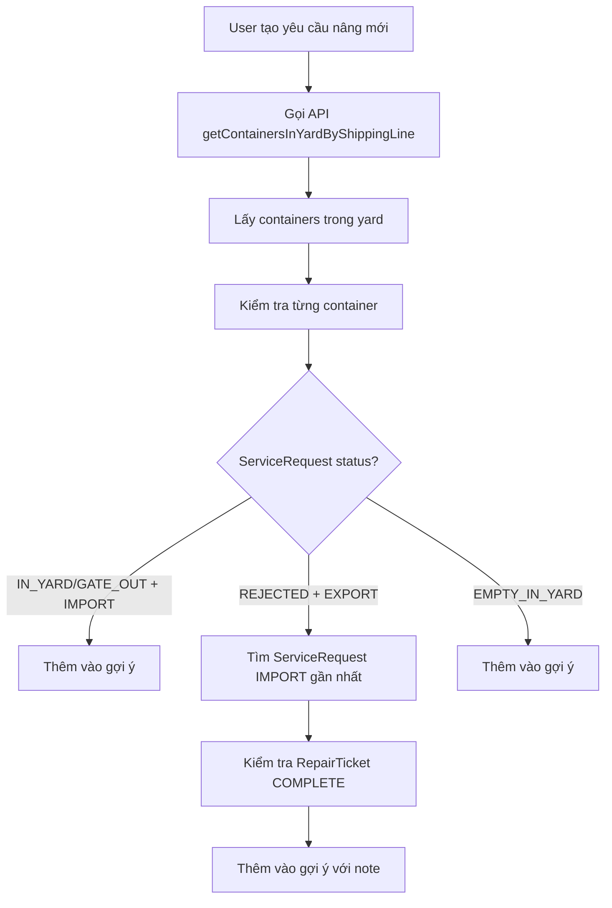

# Container Suggestion After Cancel Fix - v2025-01-27

## 📋 Tổng quan

Tài liệu này mô tả việc bổ sung logic để container có thể xuất hiện trong gợi ý sau khi yêu cầu nâng container bị hủy (REJECTED).

## 🎯 Vấn đề được giải quyết

### **Mô tả vấn đề:**
- User tạo yêu cầu nâng container cho IM1235 và IM1234
- User hủy 2 yêu cầu này (status = REJECTED)
- Khi tạo yêu cầu nâng mới, không thể thấy gợi ý cho IM1235 và IM1234
- Container không xuất hiện trong dropdown gợi ý

### **Nguyên nhân:**
1. **Logic hủy yêu cầu** chỉ cập nhật `ServiceRequest.status = 'REJECTED'`
2. **API gợi ý container** (`getContainersInYardByShippingLine`) chỉ lấy container có:
   - `EMPTY_IN_YARD` (SystemAdmin thêm)
   - `IN_YARD` hoặc `GATE_OUT` với `type = 'IMPORT'` và `quality = 'GOOD'`
3. **Không xử lý** trường hợp container có ServiceRequest bị REJECTED

## 🔧 Giải pháp đã thực hiện

### **1. Bổ sung logic trong cancelController.ts**

```typescript
// 🔄 BỔ SUNG LOGIC: Cập nhật trạng thái container để có thể nâng lại
if (request.container_no && request.type === 'EXPORT') {
    console.log(`🔄 [Cancel Request] Container ${request.container_no} - yêu cầu nâng bị hủy, cập nhật trạng thái để có thể nâng lại`);
    
    // Tìm container trong yard
    const yardPlacement = await tx.yardPlacement.findFirst({
        where: {
            container_no: request.container_no,
            status: 'OCCUPIED',
            removed_at: null
        }
    });

    if (yardPlacement) {
        // Container vẫn ở trong yard, cần đảm bảo có thể nâng lại
        // Kiểm tra xem container có phải là EMPTY_IN_YARD (SystemAdmin thêm) không
        const containerRecord = await tx.container.findFirst({
            where: {
                container_no: request.container_no,
                service_status: 'EMPTY_IN_YARD'
            }
        });

        if (containerRecord) {
            // Container là EMPTY_IN_YARD, không cần làm gì thêm
            console.log(`✅ Container ${request.container_no} là EMPTY_IN_YARD, sẵn sàng để nâng lại`);
        } else {
            // Container từ IMPORT, cần đảm bảo có RepairTicket với status COMPLETE
            const repairTicket = await tx.repairTicket.findFirst({
                where: {
                    container_no: request.container_no,
                    status: 'COMPLETE'
                },
                orderBy: { updatedAt: 'desc' }
            });

            if (repairTicket) {
                console.log(`✅ Container ${request.container_no} có RepairTicket COMPLETE, sẵn sàng để nâng lại`);
            } else {
                console.log(`⚠️ Container ${request.container_no} không có RepairTicket COMPLETE, có thể không xuất hiện trong gợi ý`);
            }
        }
    } else {
        console.log(`⚠️ Container ${request.container_no} không tìm thấy trong yard, có thể đã bị xóa khỏi bãi`);
    }
}
```

### **2. Bổ sung logic trong ContainerController.ts**

```typescript
// 🔄 BỔ SUNG LOGIC: Xử lý container có ServiceRequest bị REJECTED (yêu cầu nâng bị hủy)
if (latestServiceRequest && 
    latestServiceRequest.type === 'EXPORT' &&
    latestServiceRequest.status === 'REJECTED') {
  
  console.log(`🔄 [Container Suggestion] Container ${container_no} có yêu cầu nâng bị hủy, kiểm tra khả năng nâng lại`);
  
  // Tìm ServiceRequest IMPORT gần nhất để lấy thông tin container
  const importRequest = await prisma.serviceRequest.findFirst({
    where: { 
      container_no,
      type: 'IMPORT',
      status: { in: ['IN_YARD', 'GATE_OUT'] },
      depot_deleted_at: null
    },
    orderBy: { createdAt: 'desc' },
    include: {
      shipping_line: { select: { id: true, name: true, code: true } },
      container_type: { select: { id: true, code: true, description: true } },
      customer: { select: { id: true, name: true, code: true } }
    }
  });

  if (importRequest) {
    // Kiểm tra container quality - phải có RepairTicket với status COMPLETE (GOOD)
    const repairTicket = await prisma.repairTicket.findFirst({
      where: { 
        container_no,
        status: 'COMPLETE' // Container quality GOOD
      },
      orderBy: { updatedAt: 'desc' }
    });

    // Chỉ thêm vào kết quả nếu container có quality GOOD
    if (repairTicket) {
      console.log(`✅ [Container Suggestion] Container ${container_no} sẵn sàng để nâng lại sau khi hủy yêu cầu`);
      result.push({
        container_no,
        slot_code: yardContainer.slot?.code || '',
        block_code: yardContainer.slot?.block?.code || '',
        yard_name: yardContainer.slot?.block?.yard?.name || '',
        tier: yardContainer.tier,
        placed_at: yardContainer.placed_at,
        shipping_line: importRequest.shipping_line,
        container_type: importRequest.container_type,
        customer: importRequest.customer,
        seal_number: importRequest.seal_number,
        dem_det: importRequest.dem_det,
        service_status: importRequest.status,
        request_type: 'IMPORT',
        container_quality: 'GOOD',
        note: 'Có thể nâng lại sau khi hủy yêu cầu trước đó' // Thêm ghi chú
      });
    } else {
      console.log(`⚠️ [Container Suggestion] Container ${container_no} không có RepairTicket COMPLETE, không thể nâng lại`);
    }
  } else {
    console.log(`⚠️ [Container Suggestion] Container ${container_no} không tìm thấy ServiceRequest IMPORT hợp lệ`);
  }
  continue;
}
```

## 📊 Luồng xử lý mới

### **Trường hợp 1: Hủy yêu cầu nâng container**


### **Trường hợp 2: Gợi ý container cho yêu cầu mới**


## 🎯 Kết quả mong đợi

### **Trước khi sửa:**
- Container IM1235, IM1234 không xuất hiện trong gợi ý
- User không thể tạo yêu cầu nâng mới cho 2 container này

### **Sau khi sửa:**
- Container IM1235, IM1234 xuất hiện trong gợi ý
- User có thể tạo yêu cầu nâng mới cho 2 container này
- Container có ghi chú "Có thể nâng lại sau khi hủy yêu cầu trước đó"

## 🔍 Điều kiện container có thể nâng lại

Container sẽ xuất hiện trong gợi ý nếu thỏa mãn **TẤT CẢ** điều kiện sau:

1. **Trong yard:** Container có `YardPlacement` với `status = 'OCCUPIED'` và `removed_at = null`
2. **Shipping line:** Container thuộc shipping line đã chọn
3. **Quality:** Container có `RepairTicket` với `status = 'COMPLETE'` (GOOD)
4. **ServiceRequest:** Có ServiceRequest IMPORT với `status = 'IN_YARD'` hoặc `'GATE_OUT'`

## 📝 Logging và Debug

Hệ thống sẽ ghi log chi tiết để debug:

```
🔄 [Cancel Request] Container IM1235 - yêu cầu nâng bị hủy, cập nhật trạng thái để có thể nâng lại
✅ Container IM1235 có RepairTicket COMPLETE, sẵn sàng để nâng lại

🔄 [Container Suggestion] Container IM1235 có yêu cầu nâng bị hủy, kiểm tra khả năng nâng lại
✅ [Container Suggestion] Container IM1235 sẵn sàng để nâng lại sau khi hủy yêu cầu
```

## 🚀 Cách test

1. **Tạo yêu cầu nâng** cho container IM1235, IM1234
2. **Hủy yêu cầu** (status = REJECTED)
3. **Tạo yêu cầu nâng mới** và kiểm tra gợi ý
4. **Xác nhận** container IM1235, IM1234 xuất hiện trong dropdown

## 📋 Files đã thay đổi

- `backend/modules/requests/controller/cancelController.ts`
- `backend/modules/containers/controller/ContainerController.ts`
- `backend/docs/CONTAINER_SUGGESTION_AFTER_CANCEL_FIX.md` (tài liệu này)

