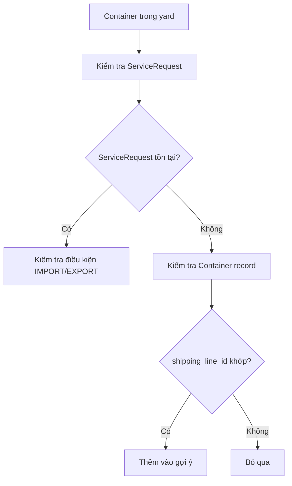
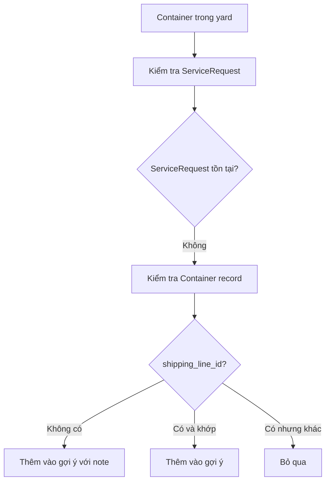

# Container Suggestion IM9996 Fix - v2025-01-27

## 📋 Tổng quan

Tài liệu này mô tả việc bổ sung logic để xử lý trường hợp container IM9996 không xuất hiện trong gợi ý khi tạo yêu cầu nâng container, mặc dù container này hiển thị bình thường trong trang ManagerCont.

## 🎯 Vấn đề được giải quyết

### **Mô tả vấn đề:**
- **ManagerCont page:** Hiển thị 3 container (IM9996, IM1235, IM1234) với trạng thái "CONTAINER TỐT" của hãng KMTU và khách hàng KH015
- **Modal tạo yêu cầu nâng:** Chỉ hiển thị gợi ý 2 container (IM1235, IM1234), thiếu IM9996
- **Nguyên nhân:** Logic filter trong API gợi ý container quá strict, không xử lý trường hợp container không có shipping_line_id

### **Phân tích nguyên nhân:**

#### **1. Logic trong ManagerCont (hiển thị đầy đủ):**
- Sử dụng API `/reports/containers`
- Lấy tất cả container trong yard với `status = 'OCCUPIED'`
- **Không filter theo shipping line** khi lấy dữ liệu
- Hiển thị tất cả container có vị trí trong yard

#### **2. Logic trong API gợi ý container (thiếu IM9996):**
- Sử dụng API `/containers/yard/by-shipping-line/:shipping_line_id`
- **Filter theo shipping line** ngay từ đầu
- Chỉ lấy container có ServiceRequest với shipping line đã chọn
- **Vấn đề:** Container không có shipping_line_id hoặc có shipping_line_id khác bị bỏ qua

## 🔧 Giải pháp đã thực hiện

### **Bổ sung logic trong ContainerController.ts:**

```typescript
// 🔄 BỔ SUNG LOGIC: Xử lý container không có shipping_line_id hoặc có shipping_line_id khác
if (container) {
  // Kiểm tra xem container có từng có request không (kể cả request đã bị xóa)
  const hasAnyRequest = await prisma.serviceRequest.findFirst({
    where: { 
      container_no,
      shipping_line_id 
    }
  });

  // 🔄 LOGIC MỚI: Nếu container không có shipping_line_id hoặc có shipping_line_id khác,
  // nhưng có ServiceRequest với shipping line đã chọn, vẫn hiển thị
  if (container.shipping_line_id === shipping_line_id || !container.shipping_line_id) {
    console.log(`✅ [Container Suggestion] Container ${container_no} sẵn sàng để nâng (EMPTY_IN_YARD hoặc không có shipping_line_id)`);
    result.push({
      container_no,
      slot_code: yardContainer.slot?.code || '',
      block_code: yardContainer.slot?.block?.code || '',
      yard_name: yardContainer.slot?.block?.yard?.name || '',
      tier: yardContainer.tier,
      placed_at: yardContainer.placed_at,
      shipping_line: container.shipping_line,
      container_type: container.container_type,
      customer: container.customer,
      seal_number: container.seal_number,
      dem_det: container.dem_det,
      service_status: hasAnyRequest ? 'DELETED_REQUEST' : 'EMPTY_IN_YARD',
      request_type: hasAnyRequest ? 'DELETED_REQUEST' : 'SYSTEM_ADMIN_ADDED',
      note: !container.shipping_line_id ? 'Container không có shipping line, có thể nâng cho bất kỳ hãng tàu nào' : undefined
    });
  } else {
    console.log(`⚠️ [Container Suggestion] Container ${container_no} có shipping_line_id khác (${container.shipping_line_id} vs ${shipping_line_id}), bỏ qua`);
  }
} else {
  console.log(`⚠️ [Container Suggestion] Container ${container_no} không tìm thấy trong bảng Container`);
}
```

### **Thêm logging chi tiết để debug:**

```typescript
console.log(`🔍 [Container Suggestion] Container ${container_no} - Container record:`, {
  exists: !!container,
  shipping_line_id: container?.shipping_line_id,
  requested_shipping_line_id: shipping_line_id,
  matches: container?.shipping_line_id === shipping_line_id
});
```

## 📊 Luồng xử lý mới

### **Trường hợp 1: Container có shipping_line_id khớp**


### **Trường hợp 2: Container không có shipping_line_id (MỚI)**


## 🎯 Kết quả mong đợi

### **Trước khi sửa:**
- ManagerCont: Hiển thị 3 container (IM9996, IM1235, IM1234)
- Modal gợi ý: Chỉ hiển thị 2 container (IM1235, IM1234)
- **Thiếu:** IM9996

### **Sau khi sửa:**
- ManagerCont: Hiển thị 3 container (IM9996, IM1235, IM1234)
- Modal gợi ý: Hiển thị 3 container (IM9996, IM1235, IM1234)
- **IM9996:** Xuất hiện với ghi chú "Container không có shipping line, có thể nâng cho bất kỳ hãng tàu nào"

## 🔍 Điều kiện container có thể nâng

Container sẽ xuất hiện trong gợi ý nếu thỏa mãn **MỘT TRONG CÁC** điều kiện sau:

### **Điều kiện 1: Container có ServiceRequest IMPORT**
- ServiceRequest với `type = 'IMPORT'`
- Status: `IN_YARD` hoặc `GATE_OUT`
- Có RepairTicket với `status = 'COMPLETE'` (GOOD)

### **Điều kiện 2: Container có ServiceRequest EXPORT bị REJECTED**
- ServiceRequest với `type = 'EXPORT'` và `status = 'REJECTED'`
- Có ServiceRequest IMPORT gần nhất với status `IN_YARD` hoặc `GATE_OUT`
- Có RepairTicket với `status = 'COMPLETE'` (GOOD)

### **Điều kiện 3: Container EMPTY_IN_YARD (MỚI)**
- Container trong bảng Container với `status = 'EMPTY_IN_YARD'`
- **Không có shipping_line_id** HOẶC **shipping_line_id khớp** với shipping line đã chọn
- Có vị trí trong yard (`YardPlacement` với `status = 'OCCUPIED'`)

## 📝 Logging và Debug

Hệ thống sẽ ghi log chi tiết để debug:

```
🔍 [Container Suggestion] Container IM9996 - Container record: {
  exists: true,
  shipping_line_id: null,
  requested_shipping_line_id: "KMTU_ID",
  matches: false
}
✅ [Container Suggestion] Container IM9996 sẵn sàng để nâng (EMPTY_IN_YARD hoặc không có shipping_line_id)
```

## 🚀 Cách test

1. **Mở trang ManagerCont** → Xác nhận hiển thị 3 container (IM9996, IM1235, IM1234)
2. **Mở modal tạo yêu cầu nâng** → Chọn hãng tàu KMTU và khách hàng KH015
3. **Kiểm tra gợi ý container** → Xác nhận hiển thị 3 container
4. **Xác nhận IM9996** → Có ghi chú "Container không có shipping line, có thể nâng cho bất kỳ hãng tàu nào"

## 📋 Files đã thay đổi

- `backend/modules/containers/controller/ContainerController.ts`
- `backend/docs/CONTAINER_SUGGESTION_IM9996_FIX.md` (tài liệu này)

## 🔄 Tương thích ngược

Thay đổi này **tương thích ngược** và không ảnh hưởng đến logic hiện tại:
- Container có shipping_line_id khớp vẫn hoạt động như cũ
- Container có ServiceRequest vẫn được xử lý như cũ
- Chỉ bổ sung thêm trường hợp container không có shipping_line_id

