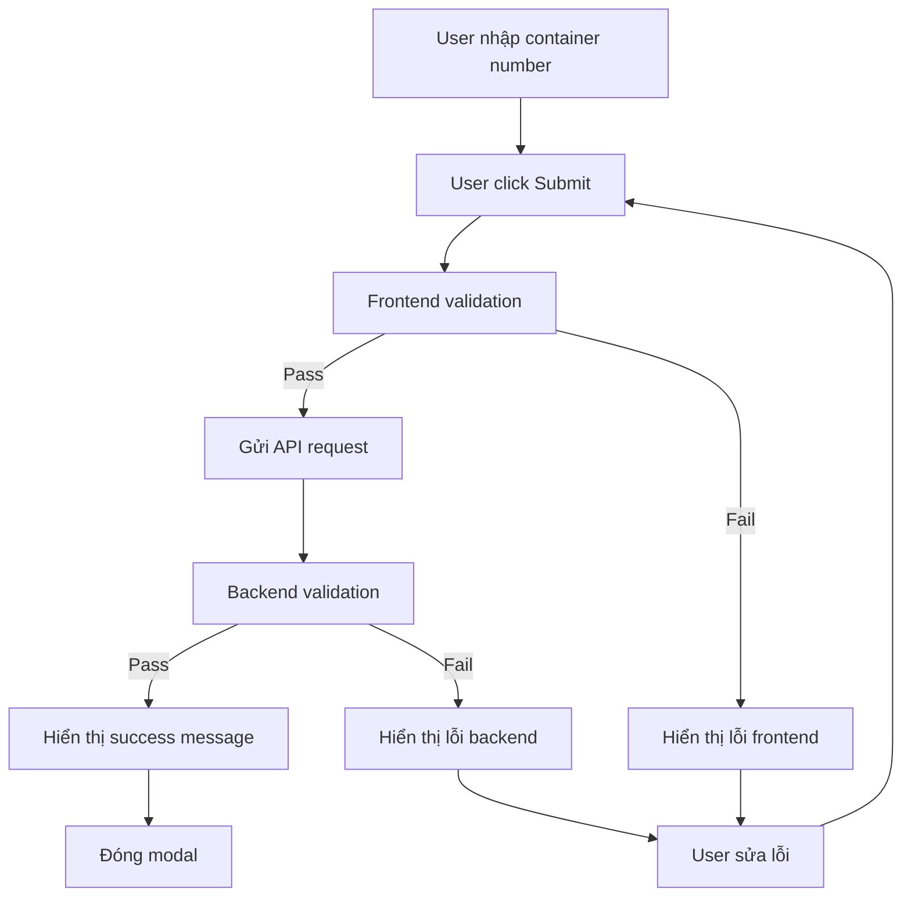

# 🎨 Frontend Container Duplicate Validation

## Tổng quan

Tài liệu này mô tả cách frontend xử lý validation container duplicate trong form tạo request import.

## 🎯 Mục đích

- **Hiển thị lỗi rõ ràng**: Thông báo lỗi dễ hiểu cho người dùng
- **UX tốt**: Không cho phép submit form khi có lỗi
- **Real-time feedback**: Hiển thị lỗi ngay khi API trả về

## 🔧 Implementation

### RequestForm Component

**File:** `components/RequestForm.tsx`

#### State Management

```typescript
const [form, setForm] = useState({ 
    type: 'IMPORT', 
    container_no: '', 
    etaDate: '', 
    etaTime: '' 
});
const [selectedFiles, setSelectedFiles] = useState<File[]>([]);
const [loading, setLoading] = useState(false);
const [message, setMessage] = useState(''); // Thông báo lỗi/thành công
```

#### Error Handling

```typescript
const handleSubmit = async (e: React.FormEvent) => {
    e.preventDefault();
    setLoading(true);
    setMessage(''); // Clear previous messages

    try {
        // Tạo FormData và gửi request
        const formData = new FormData();
        formData.append('type', form.type);
        
        if (form.type === 'IMPORT') {
            formData.append('container_no', form.container_no);
            selectedFiles.forEach((file) => {
                formData.append('documents', file);
            });
        }
        
        if (form.etaDate && form.etaTime) {
            const etaDateTime = `${form.etaDate}T${form.etaTime}`;
            formData.append('eta', etaDateTime);
        }

        await api.post('/requests', formData, {
            headers: { 'Content-Type': 'multipart/form-data' }
        });
        
        setMessage(t('pages.requests.form.success'));
        setTimeout(() => onSuccess(), 1000);
        
    } catch (error: any) {
        // Xử lý lỗi từ backend
        setMessage(error?.response?.data?.message || t('common.error'));
    } finally {
        setLoading(false);
    }
};
```

#### UI Error Display

```typescript
{message && (
    <div className={`form-message ${
        message.includes(t('pages.requests.form.success')) ? 'success' : 'error'
    }`}>
        {message}
    </div>
)}
```

## 🎨 UI Components

### Form Structure

```tsx
<form onSubmit={handleSubmit} className="request-form">
    {/* Request Type Selection */}
    <div className="form-group">
        <label htmlFor="type">{t('pages.requests.form.requestType')}</label>
        <select 
            id="type"
            value={form.type} 
            onChange={e => setForm({...form, type: e.target.value})}
            required
        >
            <option value="IMPORT">{t('pages.requests.filterOptions.import')}</option>
            <option value="EXPORT">{t('pages.requests.filterOptions.export')}</option>
        </select>
    </div>

    {/* Container Number Input - Only for IMPORT */}
    {form.type === 'IMPORT' && (
        <div className="form-group">
            <label htmlFor="container_no">
                {t('pages.requests.form.containerId')} 
                <span className="required">*</span>
            </label>
            <input 
                id="container_no"
                type="text"
                placeholder={t('pages.requests.form.containerIdPlaceholder')} 
                value={form.container_no} 
                onChange={e => setForm({...form, container_no: e.target.value})}
            />
        </div>
    )}

    {/* Error/Success Message */}
    {message && (
        <div className={`form-message ${
            message.includes(t('pages.requests.form.success')) ? 'success' : 'error'
        }`}>
            {message}
        </div>
    )}

    {/* Submit Button */}
    <div className="form-actions">
        <button 
            type="submit" 
            className="btn btn-primary" 
            disabled={loading}
        >
            {loading ? t('pages.requests.form.creating') : t('pages.requests.form.createRequest')}
        </button>
    </div>
</form>
```

### Error Message Styles

```css
.form-message {
    padding: 12px 16px;
    border-radius: 4px;
    margin: 16px 0;
    font-size: 14px;
}

.form-message.error {
    background-color: #fef2f2;
    border: 1px solid #fecaca;
    color: #dc2626;
}

.form-message.success {
    background-color: #f0fdf4;
    border: 1px solid #bbf7d0;
    color: #16a34a;
}

.required {
    color: #dc2626;
    margin-left: 4px;
}
```

## 🔄 Error Flow



## 📱 User Experience

### Error Messages

1. **Container đã tồn tại:**
   ```
   Container ISO 1234 đã tồn tại trong hệ thống với trạng thái PENDING. 
   Chỉ có thể tạo request mới khi container không còn trong hệ thống.
   ```

2. **Container trong yard:**
   ```
   Container ISO 1234 đã được đặt vào yard và chưa được xuất. 
   Không thể tạo request import mới.
   ```

3. **Lỗi network:**
   ```
   Có lỗi xảy ra. Vui lòng thử lại sau.
   ```

### Loading States

```typescript
// Button loading state
<button 
    type="submit" 
    className="btn btn-primary" 
    disabled={loading}
>
    {loading ? 'Đang tạo...' : 'Tạo yêu cầu'}
</button>

// Form loading state
{loading && (
    <div className="loading-overlay">
        <div className="spinner"></div>
        <p>Đang xử lý yêu cầu...</p>
    </div>
)}
```

## 🧪 Testing

### Manual Testing

1. **Test với container đã tồn tại:**
   - Nhập container number đã có trong hệ thống
   - Click "Tạo yêu cầu"
   - Kiểm tra hiển thị thông báo lỗi

2. **Test với container mới:**
   - Nhập container number chưa có
   - Click "Tạo yêu cầu"
   - Kiểm tra tạo thành công

3. **Test validation frontend:**
   - Để trống container number
   - Click "Tạo yêu cầu"
   - Kiểm tra hiển thị lỗi validation

### Automated Testing

```typescript
// Test error handling
test('should display error message when container exists', async () => {
    const mockError = {
        response: {
            data: {
                message: 'Container ISO 1234 đã tồn tại trong hệ thống'
            }
        }
    };
    
    jest.spyOn(api, 'post').mockRejectedValueOnce(mockError);
    
    render(<RequestForm onSuccess={jest.fn()} onCancel={jest.fn()} />);
    
    // Fill form and submit
    fireEvent.change(screen.getByLabelText('Mã định danh container'), {
        target: { value: 'ISO 1234' }
    });
    fireEvent.click(screen.getByText('Tạo yêu cầu'));
    
    // Check error message
    await waitFor(() => {
        expect(screen.getByText('Container ISO 1234 đã tồn tại trong hệ thống')).toBeInTheDocument();
    });
});
```

## 📁 File Mapping

### Frontend Files

| File | Mô tả | Vai trò |
|------|-------|---------|
| `components/RequestForm.tsx` | Form tạo request | Xử lý input và hiển thị lỗi |
| `pages/Requests/Customer.tsx` | Trang customer requests | Modal chứa form |
| `services/api.ts` | API service | Gửi request đến backend |
| `hooks/useTranslation.ts` | Translation hook | Đa ngôn ngữ |
| `styles/request-form.css` | CSS styles | Styling cho form và messages |

### Translation Files

| File | Key | Value |
|------|-----|-------|
| `locales/vi.json` | `pages.requests.form.validation.containerIdRequired` | "Mã định danh container là bắt buộc" |
| `locales/vi.json` | `pages.requests.form.validation.documentRequired` | "Chứng từ là bắt buộc" |
| `locales/vi.json` | `common.error` | "Có lỗi xảy ra" |

## 🚀 Deployment

### Changes Required

1. **RequestForm.tsx** - Đã có sẵn error handling
2. **Translation files** - Có thể thêm message tùy chỉnh
3. **CSS** - Có thể cải thiện styling cho error messages

### No Breaking Changes

- Không thay đổi API contract
- Không thay đổi component props
- Chỉ cải thiện error handling

## 🔍 Monitoring

### Error Tracking

```typescript
// Track validation errors
const trackValidationError = (containerNo: string, error: string) => {
    analytics.track('container_validation_error', {
        container_no: containerNo,
        error_message: error,
        timestamp: new Date().toISOString()
    });
};
```

### User Behavior

- Số lần user thử tạo duplicate request
- Container numbers bị duplicate nhiều nhất
- Thời gian user sửa lỗi và submit lại

## 📝 Best Practices

1. **Clear Error Messages**: Thông báo lỗi rõ ràng, dễ hiểu
2. **Loading States**: Hiển thị trạng thái loading khi xử lý
3. **Form Validation**: Validate frontend trước khi gửi API
4. **Error Recovery**: Cho phép user sửa lỗi và thử lại
5. **Accessibility**: Error messages có thể đọc được bởi screen reader

## 🔄 Future Enhancements

1. **Real-time Validation**: Kiểm tra container number khi user nhập
2. **Auto-suggest**: Gợi ý container numbers hợp lệ
3. **Bulk Import**: Hỗ trợ import nhiều containers cùng lúc
4. **Error History**: Lưu lịch sử lỗi để debug
5. **Offline Support**: Xử lý lỗi khi mất kết nối
